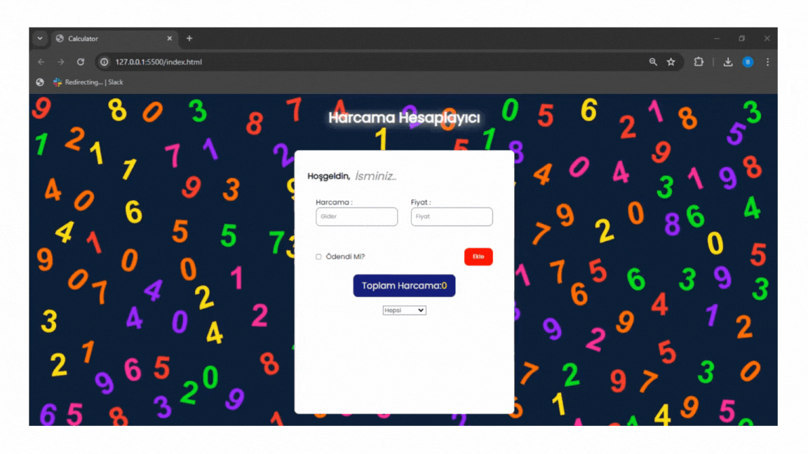

## Calculator 

- Bu harcama hesaplayıcısı projesi, kullanıcıların gelir ve giderlerini izlemelerine ve harcama alışkanlıklarını anlamalarına yardımcı olan basit bir web uygulamasıdır. Proje, HTML, CSS ve JavaScript kullanılarak geliştirilmiştir.

- ### Proje Amaçları

- Kullanıcıların gelir ve giderlerini kolayca eklemelerini sağlamak.

- Harcamaları kategorize ederek daha iyi bir bütçe yönetimi sağlamak.

- Belirli bir zaman dilimi için harcamaları raporlamak ve analiz etmek. 

### Özellikler 

- Gelir ve giderlerin eklenmesi, düzenlenmesi ve silinmesi

- Harcamaların kategorize edilmesi ve raporlanması

- Kullanıcı dostu arayüz ve kullanım kolaylığı 

### Screen 

 
